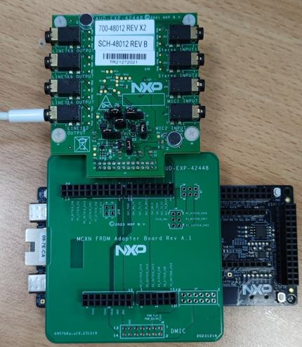
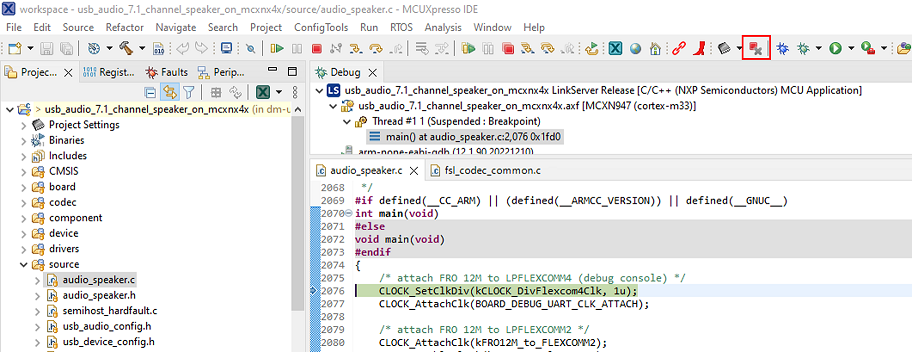

# NXP Application Code Hub

## How to implement USB audio 7.1 channel speaker on MCXN947
This demo will show you how to implement a USB audio 7.1 channel speaker on MCXN947.

#### Boards: FRDM-MCXN947, AUD-EXP-42448, MCXN FRDM adapter board
#### Categories: Audio
#### Peripherals: SAI, USB
#### Toolchains: MCUXpresso IDE

## Table of Contents
1. [Software](#step1)
2. [Hardware](#step2)
3. [Setup](#step3)
4. [Results](#step4)
5. [FAQs](#step5) 
6. [Support](#step6)
7. [Release Notes](#step7)

## 1. Software
- FRDM-MCXN947 SDK 2.14
- MCUXpresso IDE V11.9.0 or later.
- MCUXpresso for Visual Studio Code: This example supports MCUXpresso for Visual Studio Code, for more information about how to use Visual Studio Code please refer [here](https://www.nxp.com/design/training/getting-started-with-mcuxpresso-for-visual-studio-code:TIP-GETTING-STARTED-WITH-MCUXPRESSO-FOR-VS-CODE).

## 2. Hardware
- FRDM-MCXN947 Rev B
- [AUD-EXP-42448 Rev B](https://www.nxp.com/design/design-center/development-boards/i-mx-evaluation-and-development-boards/multichannel-audio-codec-card-for-evks:AUD-EXP-42448)
- MCXN FRDM adapter board Rev A1
- One type-C USB cable
- Any 3.5mm headphones or speakers

## 3. Setup
This demo is developed based on MCUXpresso IDE 11.9.0 and FRDM-MCXN947 SDK 2.14, so you need to download the MCUXPresso IDE 11.9.0 or higher version and FRDM-MCXN947 SDK 2.14, then install the SDK to MCUXpresso IDE.

### 3.1 Step 1
1. The SAI interface on the FRDM-MCXN947 J1 header is required, the default configuration of J1-3 is for motor control, so the first step is to modify the connection of J1-3, disconnect SJ10 1-2 and short SJ10 2-3.

    

2. Connect the FRDM-MCXN947, MCXN FRDM adapter board, and AUX-EXP-42448 board as shown in the figure below.

    

### 3.2 Step 2
1. Open MCUXpresso IDE 11.9.0, in the Quick Start Panel, choose **Import from Application Code Hub**

    

2. Enter the **demo name** in the search bar.

    

3. Click **copy GitHub link**, MCUXpresso IDE will automatically retrive project attributes, then click **Next>**.

    

4. Select **main** branch and then click **Next>**, select the MCUXpresso project, click **Finish** button to complete import.

### 3.3 Step 3
1. Use a type-C USB cable to connect J17 of FRDM-MCXN947 and the USB port of the PC.
2. Then click **Build** button to compile the project.

    

3. Click **Debug** button download the program into the MCXN947.
Exit debug mode of the MCUXpresso IDE and reconnect the PC USB port to FRDM-MCXN947 High-speed USB interface J11.

    

4. Press "RESET" button to run the program, PC will recognize a 7.1 channel audio device.

    

## 4. Results

1. Open the Sound Manager, click the **Configure** button, and then on the **Speak Setup** page, click the **Test** button. The PC will play the test audio. You can listen the test audio by connecting any 3.5mm headphone or speak to the four LINE OUTPUT interfaces (J6, J7, J8, J9) on AUX-EXP-42448 board.

    

## 5. FAQs
No FAQs have been identified for this project.

## 6. Support

#### Project Metadata
<!----- Boards ----->

<!----- Categories ----->

<!----- Peripherals ----->
 

<!----- Toolchains ----->

Questions regarding the content/correctness of this example can be entered as Issues within this GitHub repository.

>**Warning**: For more general technical questions regarding NXP Microcontrollers and the difference in expected funcionality, enter your questions on the [NXP Community Forum](https://community.nxp.com/)

## 7. Release Notes
| Version | Description / Update                           | Date                        |
|:-------:|------------------------------------------------|----------------------------:|
| 1.0     | Initial release on Application Code Hub        | January 30th 2024 |

